<picture>
  <source media="(prefers-color-scheme: dark)" srcset="./assets/hero-dark.svg">
  
</picture>

<div align="center">


</div>

## `~/whoami`

```bash
$ whoami
Afei · @kalaGN · backend engineer
$ cat ~/motto
Do not go gentle into that good night!
```

- **Now** — local-first RAG: hybrid retrieval (vector + BM25 + RRF), citation-verified answers, Qdrant + LlamaIndex
- **Daily drivers** — Go and PHP; Python and Java when the job asks for it
- **Writing** — [cnblogs.com/kala00k](https://www.cnblogs.com/kala00k/)
- **Principle** — no sponsorship banners, no auto-generated filler: only code I actually maintain

## `~/stack`

<table><tr>
<td>

<picture>
  <source media="(prefers-color-scheme: dark)" srcset="https://github-readme-stats.vercel.app/api?username=kalaGN&show_icons=true&hide_border=true&count_private=true&bg_color=0d1117&title_color=c4b5fd&text_color=d6e0ee&icon_color=22d3ee">
  
</picture>

</td>
<td>

<picture>
  <source media="(prefers-color-scheme: dark)" srcset="https://github-readme-stats.vercel.app/api/top-langs/?username=kalaGN&layout=compact&hide_border=true&bg_color=0d1117&title_color=c4b5fd&text_color=d6e0ee&card_width=320">
  
</picture>

</td>
</tr></table>

## `~/projects`

| Project | Stack | What it is |
| --- | --- | --- |
| [php7cc](https://github.com/kalaGN/php7cc) | PHP | PHP 7 compatibility checker — the most starred thing here |
| [agn](https://github.com/kalaGN/agn) | Go | Long-running Go API service, still getting pushes |
| [baby-feeding-dashboard](https://github.com/kalaGN/baby-feeding-dashboard) | Java | Real-time dashboard — the most recent one |
| [afw](https://github.com/kalaGN/afw) | PHP | A framework written the only way to learn one: rewrite it |
| [Donkey](https://github.com/kalaGN/Donkey) | PHP / Swoole | Second-granularity timer daemon |

## `~/activity`

<picture>
  <source media="(prefers-color-scheme: dark)" srcset="https://streak-stats.demolab.com/?user=kalaGN&hide_border=true&background=0d1117&stroke=1e2735&ring=8b5cf6&fire=22d3ee&currStreakLabel=c4b5fd&sideLabels=7488a0&dates=7488a0">
  
</picture>

---

<div align="center">

<sub>The hero is a hand-placed 5×7 dot matrix — one `<rect>` per lit pixel, gradient fill and a gaussian glow. No image-to-ASCII conversion.</sub>

</div>
